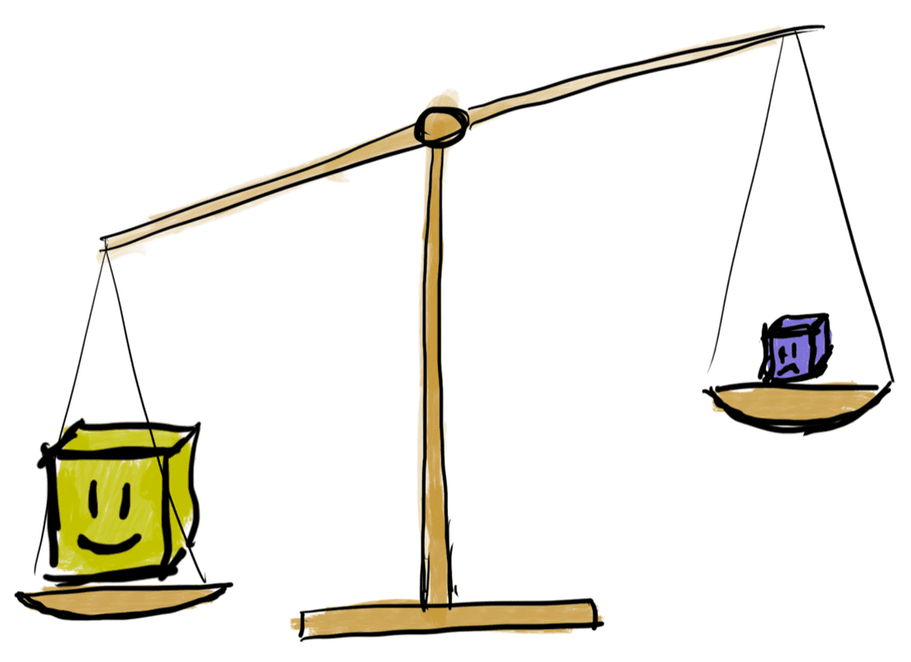
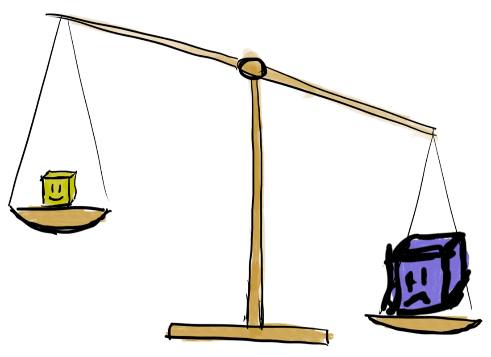
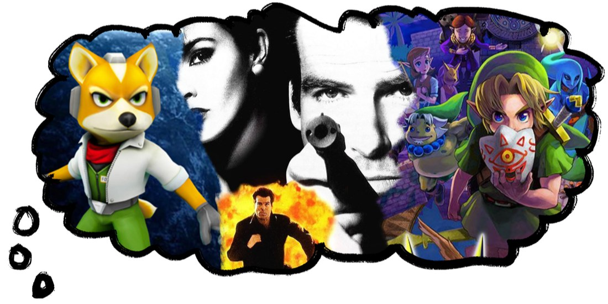
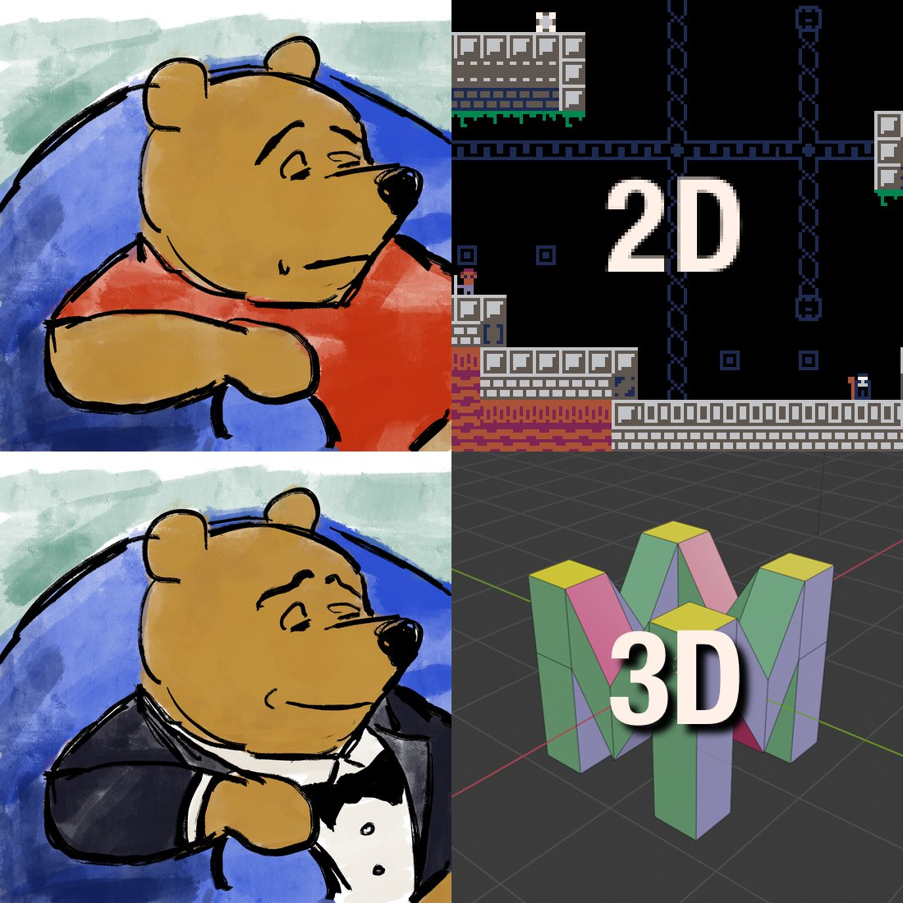
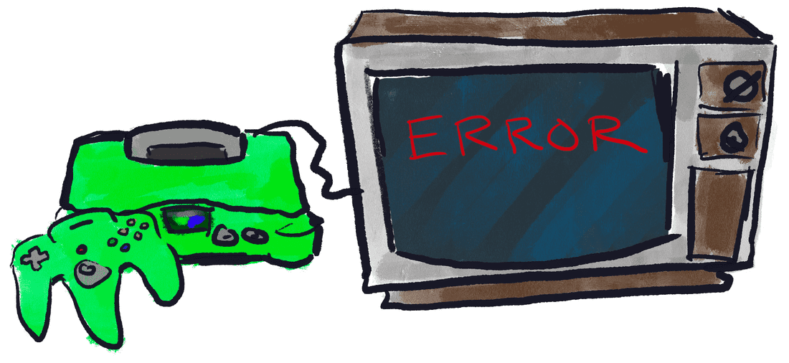
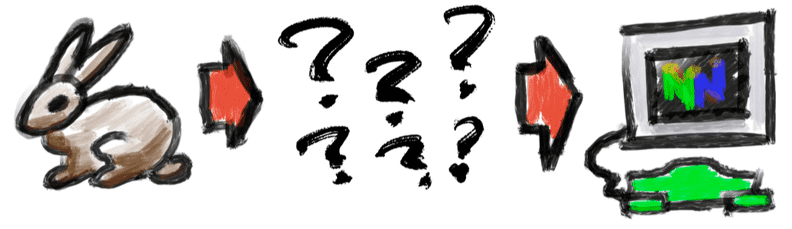

Based on
https://www.moria.us/blog/2021/07/9-reasons-why-nintendo-64-homebrew-projects-fail

# N Reasons Why Nintendo 64 Homebrew Projects Fail

Maybe you want to make a homebrew game for Nintendo 64. Heads up! Here are the nine reasons why your project might fail.

But fist, let’s talk about what a project failure looks like.

## Anatomy of Project Failure

If there’s one word that explains why most projects fail, that word is “attrition.”

Projects rarely fail for one simple reason, and most problems can be solved. Instead, there are tons of smaller problems that wear you down, and at some point, you give up. It starts out like this:

You’re excited about your project! You feel nostalgia for all the N64 games you used to play, you’re dreaming about what it will be like to have a finished game, and you’re having fun learning about N64 development. You only have a couple doubts in the back of your mind.

This feeling doesn’t last forever…

A while later, you’ve been fighting against bugs in your project for too long—bugs that drive you mad, bugs that force you to comb through the source code over and over again. It’s frustrating; it’s demoralizing. You haven’t been able to release a complete game yet. You’ve spent countless hours getting asset pipelines working, and you’ve made significant cuts to your vision for the game.

Maybe all those problems are too much. It’s not fun any more. You want your life back. You quit. Your project has succumbed to **attrition**.

If you can manage to avoid these problems or solve them early on, your project is more likely to succeed. If the homebrew community can solve some of these problems “once and for all,” we’ll see more homebrew games, and we’ll be able to welcome more people into the homebrew community.

## #1: Dream Too Big

You’re dreaming of *Goldeneye* and *Majora’s Mask*, but you should scale your dreams down if you want to make a real game.

This isn’t just about the size of the game, but it’s about the complexity, and the number of different systems you’ll implement in your Nintendo 64 game. Even basic functionality like character animations can take you days or weeks to implement. It’s not like you can just grab some example code that does what you want and stick it in your game; nearly everything is do-it-yourself.

Letting go of your dreams can be rough. I don’t want to discourage you or tell you that your dream is unrealistic. However, I also don’t want to be a spectator while you crash and burn. I want to encourage you to make smaller games because I want you to succeed.

Make a game that’s **simpler** and **smaller** than classic Nintendo 64 games. Think about simpler, classic games like *Frogger*, *Space Invaders*, or *Flappy Bird*.

On the same note…

## #2: No Respect for 2D

It’s the Nintendo 64, after all. You’re going to make a 3D game, or *fail trying*.

Stop for a moment and think, “Are 2D games inferior to 3D games?” No, you don’t feel that way. You can list a ton of 2D games that you love. So, why not make a 2D game for the Nintendo 64?

3D games are more difficult to make than 2D games, especially on the Nintendo 64. The Nintendo 64 has a very low-level interface for 3D graphics. There’s no such thing as a “camera”, “model”, or “scene” as far as the Nintendo 64 is concerned. Instead, you do all the matrix math yourself and create a list of commands like “draw these triangles on the screen” or “transform these vertexes, and store the results in the vertex cache.” In 3D, you’ll also have to figure out how to convert models from your 3D modeling program into a format that works on the N64—there’s not really a standard way to do that.

If you are unsure about your matrix math, consider 2D.

## #3: Working Solo

The Nintendo 64 homebrew community is full of passionate, independent developers. Sometimes a little too independent.

- **Make games with other people.** It takes a broad set of skills to make a Nintendo 64 game. When you team up with other people, the possibilities skyrocket.
- **Contribute to tools that other people make.** There are plenty of N64 development tools on GitHub—consider building on the tools that are already there instead of rolling your own tools from scratch.
- **Improve the documentation.** The [N64Brew Wiki](https://n64brew.dev/wiki/Main_Page) is a great resource, but it’s still not complete.

You can find people to work with on the [N64Brew Discord server](https://discord.gg/WqFgNWf).

## #4: Not Enough Testing on Hardware

Nintendo 64 emulators are not accurate. Some are more accurate than others, but it is still common to see code run correctly on an emulator and fail on real hardware. The more time you spend between tests on hardware, the harder it is to debug problems.

**Solution:** Get a Nintendo 64 and a flashcart with USB, like the [EverDrive 64 X7](https://krikzz.com/store/home/55-everdrive-64-x7.html). Note that the X5 doesn’t have USB! The X7 is expensive (USD $250) but it will save you an enormous amount of time.

**Project idea:** It would be nice to have a cheaper development cartridge. The cartridge could be USB-only, with only the features needed for development.

## #5: Slow, Difficult Iteration

You test your game on hardware? That’s slow and painful. When your game crashes, the console might just freeze, or you might get a black screen. How do you debug it? You’ll be testing new changes and debugging your game fairly often. If you have to swap SD cards to test your game, or worse, if you have to post your game on the #rom-testing channel over and over again, your progress will be slow.

Find a way to speed up the debugging process. Test your game on both real hardware and emulators. Use one of the more accurate emulators, like MAME. CEN64 is a bit less accurate, and Mupen64+ and Project64 just aren’t accurate enough for anything but the most basic testing.

You might consider making a PC version of your game in parallel, but this is easier said than done.

## #6: Asset Importing Woes

Let’s review some of the types of assets you might want in your Nintendo 64 game:

- Textures for 3D models, with mipmaps.
- 2D sprites and images.
- Fonts.
- 3D models, with animations.
- Sound effects.
- Music tracks.
- Levels for your game.

There is a hodgepodge of different asset conversion tools for Nintendo 64, and a collection of sample code for using all of these types of assets. But there’s never a clear way to use any type of asset, and the typical recommendation is to just “figure it out.” If you try using an existing tool, there’s a good chance that it’s poorly documented, incomplete, or abandoned. It may be hard to use without contacting the author or making your own fork of the tool and diving in to the tool’s code.

Some of the assets, like textures and sprites, are manageable. You can write your own conversion tools for textures easily enough. Other assets are much more difficult to work with. The best known sound tools were shipped with the original SDK, which means running a Windows XP VM, using WINE, or using Qemu with an IRIX emulation layer. 3D model conversion is even worse, and forget about animations.

**Project ideas:** What I’d like to see is a collection of “blessed” recipes for using different types of assets. This would mean writing a conversion tool, sample code, and explanations for how to tool into a build system.

## #7: Miscellaneous Technical Challenges

Fact is, there are tons of other technical challenges that come up during Nintendo 64 development. Some challenges you may encounter are:

- **Graphics performance:** It’s hard to get good performance out of the Nintendo 64.
- **Writing linker scripts:** You may have to make changes to your linker scripts.
- **Understanding the RDP:** The RDP is a beast. It has a ton of different modes, some of which don’t do anything useful.
- **Computer architecture:** You’re responsible for making sure variables are aligned and caches are flushed correctly.
- **Working without the stdlib.** You can use C or C++, but you probably shouldn’t use `std::string`, `std::vector`, or even `malloc`.

## Do It Anyway!

Make your game! It will be nothing like what you dreamed, and it will be hard work, but do it anyway!
